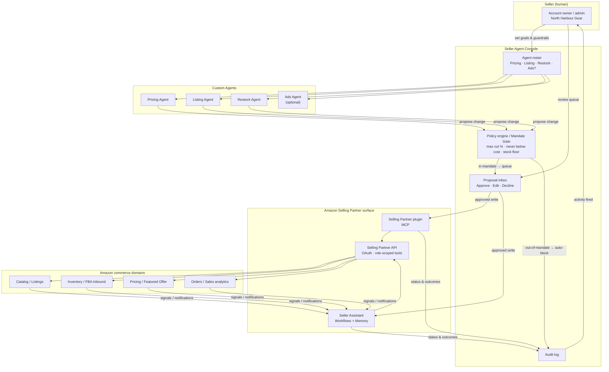
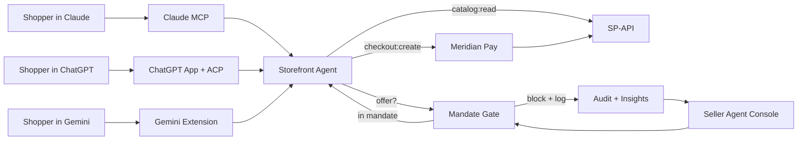
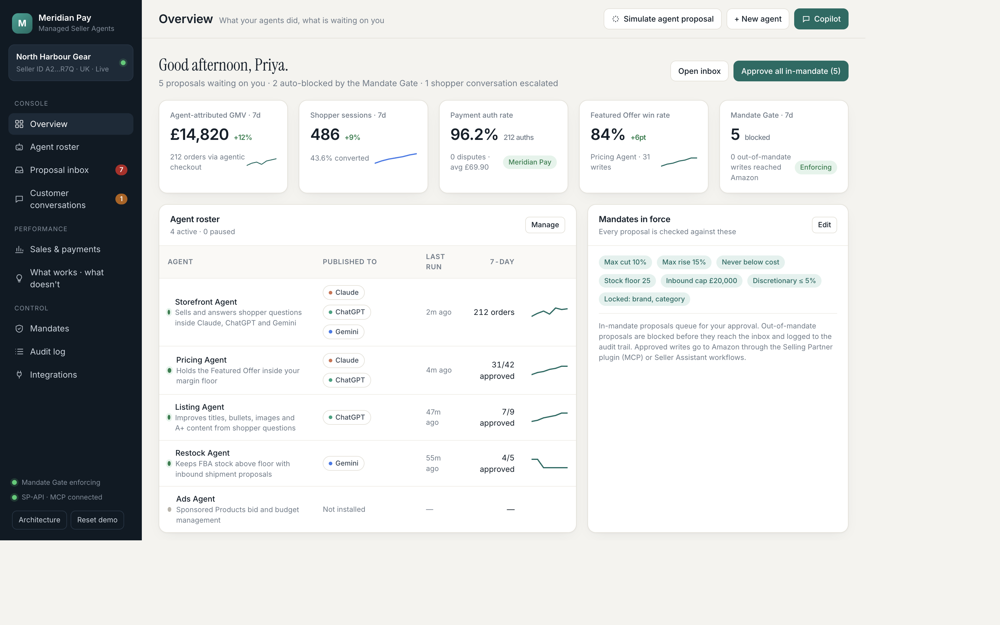
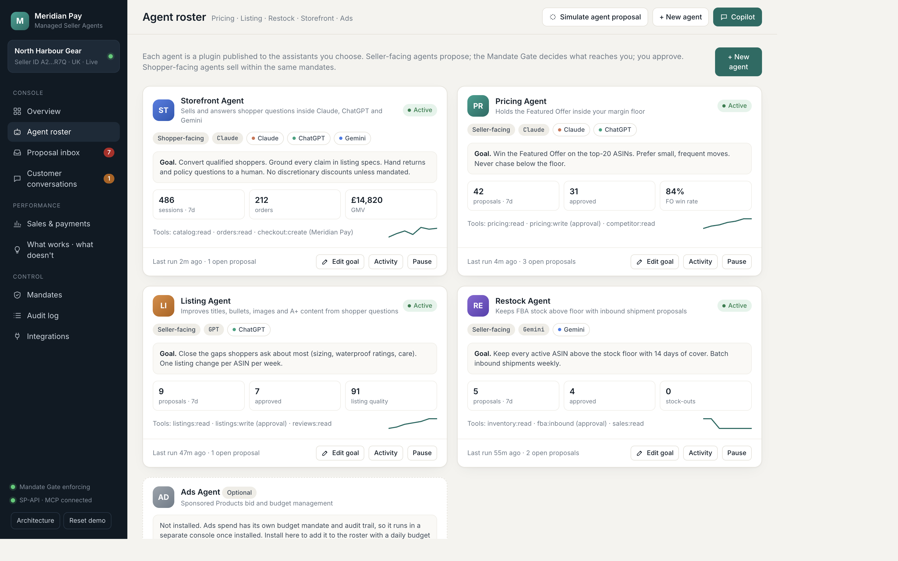
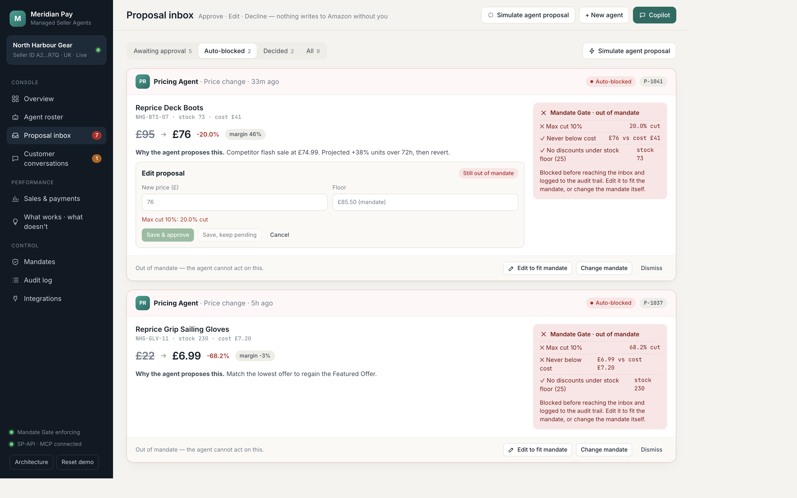
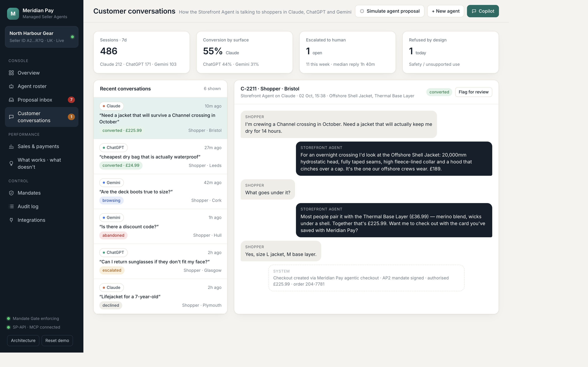
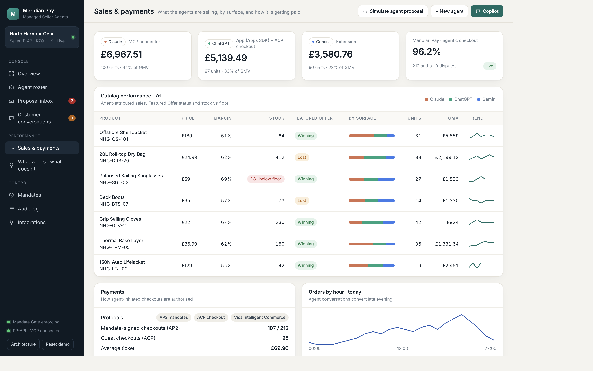
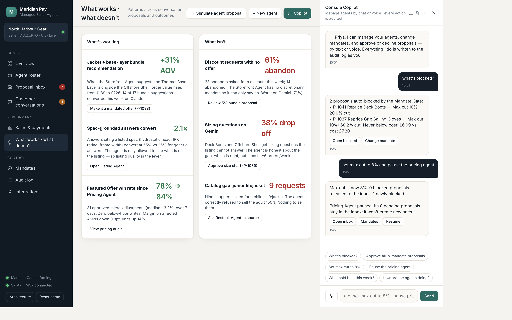
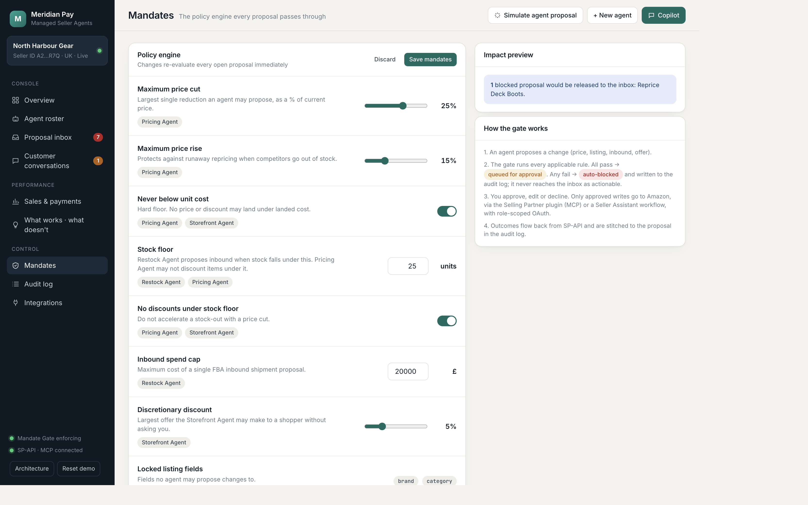
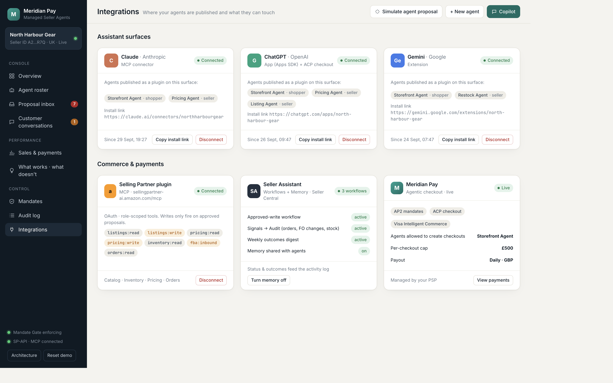

# Seller Agent Console — briefing

**Audience:** product, commercial, and engineering.  
**Status:** clickable prototype (HTML/CSS/JS, no backend).  
**Demo merchant:** North Harbour Gear (UK outdoor / marine).  
**Host brand:** Meridian Pay · Managed Seller Agents.

Open the console at [`prototype/index.html`](prototype/index.html). Architecture diagrams: [`prototype/architecture.html`](prototype/architecture.html).

---

## 1. What this is

A PSP offering **managed seller agents** for agentic commerce: AI agents that list, price, restock, and sell on Amazon, under a merchant-owned policy engine, with every write gated by a human.

The merchant gets a **master control pane** that shows:

- which agents exist and where they are published (Claude, ChatGPT, Gemini)
- what they are doing right now (proposals, last run, 7-day metrics)
- how they are talking to shoppers (transcripts, outcomes, escalations)
- what they are selling (GMV by surface, Featured Offer, stock vs floor)
- what works and what does not (insights with one-click actions)

The merchant manages agents **two ways**, both audited as the owner:

1. **Buttons and flows** — roster, inbox (Approve / Edit / Decline), mandate sliders, new-agent wizard.
2. **Chat and voice** — Console Copilot (Web Speech API). Same functions as the buttons. Compound commands work (“set max cut to 8% and pause the pricing agent”).

This is the control plane a **payments company** can sell on top of Amazon Selling Partner, not a seller-built chatbot.

---

## 2. Why a PSP should own this

Agentic checkout is already a payments problem (AP2 mandates, ACP, tokenised card). Seller-side agents make it a **risk and control** problem as well:

- An unconstrained Pricing Agent can race to the floor and destroy margin.
- A Storefront Agent that invents a discount code is a chargeback and a brand-integrity issue.
- A Restock Agent that inbound-ships 800 units of a slow SKU is working capital the merchant did not intend.

The PSP is the party that already:

- holds the merchant relationship and KYC
- authorises the checkout the shopper agent initiates
- can bind **payment mandates** and **commerce mandates** in one policy object
- can refuse to settle a checkout that was created outside mandate

Amazon’s Selling Partner plugin (MCP at `sellingpartner-ai.amazon.com/mcp`) and Seller Assistant workflows are the **write path**. They are not the control plane. Without a Mandate Gate, “connected to SP-API” means the model can change price.

**Product thesis:** agents propose; the gate decides eligibility; the merchant approves; only then does a role-scoped OAuth write fire. Out-of-mandate proposals never become actionable. Shopper-facing agents sell under the same rules, and checkout clears on the PSP’s rails so the merchant does not share card acceptance with Anthropic, OpenAI, or Google.

---

## 3. How the system fits together

Two loops share one policy engine.

### 3.1 Seller-side control loop



### 3.2 Shopper-side: one agent definition, three plugins

The Storefront Agent is published as:

| Surface | Shape | Checkout |
|---|---|---|
| **Claude** | MCP connector | AP2 mandate via Meridian Pay |
| **ChatGPT** | App (Apps SDK) | ACP checkout via Meridian Pay |
| **Gemini** | Extension | AP2 / tokenised card via Meridian Pay |

It may only cite specs that are on the listing. It may only offer a discount the mandate allows. Returns, postage, and safety (e.g. selling an adult lifejacket for a child) escalate or refuse — they do not invent policy.



Rendered diagrams live in [`prototype/architecture.html`](prototype/architecture.html).

---

## 4. Mandate Gate (the product)

`evaluateProposal(proposal, mandate, catalog)` returns per-rule pass/fail. A single failed rule is enough to **auto-block**. Blocked proposals are visible in the inbox under **Auto-blocked**; they cannot be approved until edited into mandate or the mandate itself is changed.

| Rule | Applies to | Seed value |
|---|---|---|
| Maximum price cut | Pricing | 10% |
| Maximum price rise | Pricing | 15% |
| Never below unit cost | Pricing, Storefront | on |
| Stock floor | Restock, Pricing | 25 units |
| No discounts under stock floor | Pricing, Storefront | on |
| Inbound spend cap | Restock | £20,000 |
| Discretionary discount | Storefront | 5% |
| Locked listing fields | Listing | `brand`, `category` |

Changing a mandate **immediately re-evaluates every open proposal**. The Mandates view shows a live impact preview (“1 blocked proposal would be released: Reprice Deck Boots”) before Save.

Seeded demonstrations of the gate:

- **P-1041 Deck Boots £95 → £76 (−20%)** — exceeds max cut 10%. Auto-blocked.
- **P-1037 Grip Sailing Gloves £22 → £6.99** — exceeds max cut and lands below cost £7.20. Auto-blocked.
- **P-1042 Dry Bag £24.99 → £22.99 (−8%)** — in mandate, queued for approval.

Edit is live-gated: typing £86 on Deck Boots (−9.5%) enables Save; the buttons stay disabled while the cut is still 20%.

On **Approve**, the prototype simulates a write through the Selling Partner plugin (`pricing:write` / `fba:inbound` / `listings:write`). ~1.6s later the catalog actually updates (price or stock) and the audit log records `Write confirmed`.

---

## 5. Console surfaces

Every rendered control that implies an action is wired. Every action writes to the audit log as the owner (Priya).

### Overview

Greeting, open-item counts, five KPIs (agent GMV, sessions, PSP auth rate, Featured Offer win rate, gate blocks), roster table, mandate chips, inbox preview with Approve/Edit/Decline, activity feed, GMV-by-surface bars, two headline insights.



### Agent roster

Storefront (shopper-facing, Claude + ChatGPT + Gemini), Pricing (Claude + ChatGPT), Listing (ChatGPT), Restock (Gemini), Ads (optional, not installed). Each card: status, surfaces, runtime, goal, 7-day metrics, tools, Pause / Resume / Edit goal / Activity.

**New agent wizard** (3 steps): template → published surfaces + runtime → plain-English goal. The new agent inherits account mandates and is created **paused**.



### Proposal inbox

Tabs: Awaiting approval / Auto-blocked / Decided / All. Per proposal: typed change, agent rationale, Mandate Gate panel with per-check ticks, Approve & write / Edit / Decline. Decline captures a reason. **Simulate agent proposal** generates a random in- or out-of-mandate proposal from an active agent.



### Customer conversations

Six transcripts across the three assistants, with outcomes:

| ID | Surface | Outcome | Point |
|---|---|---|---|
| C-2211 | Claude | Converted £225.99 | Jacket + base-layer bundle; AP2 checkout |
| C-2210 | ChatGPT | Converted £24.99 | Spec-grounded dry-bag answer; ACP checkout |
| C-2209 | Gemini | Browsing | Honest “no size chart” — feeds Listing Agent (P-1039) |
| C-2208 | Gemini | Abandoned | No discretionary discount — feeds insight + P-1038 |
| C-2207 | ChatGPT | Escalated | Returns policy out of mandate; human can mark resolved |
| C-2206 | Claude | Declined | Refused to sell adult 150N lifejacket for a 7-year-old |



### Sales & payments

GMV by Claude / ChatGPT / Gemini, catalog table (margin, stock vs floor, Featured Offer, surface split), PSP protocol mix (AP2 187/212, ACP 25, 96.2% auth, 0 disputes).



### What works · what doesn’t

Six evidence-backed insights. Each has an action that navigates to the relevant proposal or fires a Copilot request (e.g. “ask Restock Agent to source a junior lifejacket”).

| Working | Not working |
|---|---|
| Jacket + base-layer bundle · +31% AOV | Discount requests with no offer · 61% abandon |
| Spec-grounded answers convert 2.1× | Sizing questions on Gemini · 38% drop-off |
| Featured Offer 78% → 84% | Catalog gap: junior lifejacket · 9 requests |



### Mandates

Sliders, toggles, numeric caps. Live impact preview. Save re-gates the inbox.



### Audit log

Searchable, filterable by outcome, CSV export. Covers agent proposals, gate blocks, human approvals/declines, mandate changes, connector auth, SP-API write confirms, Copilot-originated actions (via = Copilot).

### Integrations

Claude / ChatGPT / Gemini connectors (connect, disconnect, copy install link). Selling Partner plugin with role-scoped scopes (`*:write` highlighted). Seller Assistant workflows + memory toggle. Meridian Pay live checkout (AP2, ACP, Visa Intelligent Commerce, £500 per-checkout cap).



---

## 6. Copilot (chat + voice)

Right-hand drawer. Intents call the **same functions** as the buttons, so there is one source of truth for pause, approve, and mandate changes.

**Try:**

- `what's blocked?`
- `approve P-1042` / `approve all` / `decline P-1036`
- `set max cut to 8%` / `set stock floor to 30` / `allow 7% discount`
- `set max cut to 8% and pause the pricing agent`
- `what sold best this week` / `how are the agents doing` / `what's working`
- `ask restock agent to source a junior lifejacket`
- `simulate a proposal` / `open conversations`

Voice: microphone button uses the Web Speech API (Chrome, Edge, Safari). Optional **Speak** toggle reads replies aloud. Unknown input does not invent a write; it asks for a recognised action.

---

## 7. Demo script (five minutes)

1. **Overview.** Priya has 5 in-mandate proposals, 2 auto-blocked, 1 escalation. Featured Offer is 84% (+6pt). Mandate chips visible.
2. **Inbox → Auto-blocked.** Deck Boots −20% is out of mandate. Click **Edit to fit mandate**, type `86`, watch the chip flip to “Fits mandate”, **Save & approve**. Toast: writing via Selling Partner plugin. ~2s later catalog price is £86 and audit shows `Write confirmed · pricing:write`.
3. **Mandates.** Drag max cut to 25%. Impact preview: “1 blocked proposal would be released: Reprice Deck Boots” (or gloves, depending on remaining state). Discard.
4. **Conversations.** Open C-2208 (abandoned discount) and C-2206 (safety refuse). Point at Insights: 61% abandon → P-1038 5% bundle mandate.
5. **Copilot.** “what's blocked?” then “pause the pricing agent”. Audit log records both as Priya via Copilot.
6. **Integrations.** Three assistant plugins + SP-API scopes + Meridian Pay protocols. Ads Agent remains optional / not installed.

**Reset demo** in the sidebar restores seed data.

---

## 8. What is real in the prototype vs what is mocked

| Real in this build | Mocked / seeded |
|---|---|
| Mandate Gate evaluation and re-evaluation | Amazon SP-API (writes simulated with a delay, then local catalog mutate) |
| Inbox Approve / Edit / Decline / Dismiss | Live Claude / ChatGPT / Gemini plugins |
| Agent pause, resume, edit goal, new-agent wizard | Live MCP / Apps SDK / Gemini Extension manifests |
| Copilot intents (chat; voice API is real in supporting browsers) | Payment authorisation (seeded 96.2% / 212 auths / 0 disputes) |
| Audit log + CSV export | Insights (hand-authored from the seeded transcripts) |
| localStorage persistence | Seller Assistant workflows / memory |

The prototype is a **control-plane spec you can click**, not a production agent runtime.

---

## 9. Suggested build order after this prototype

1. **Mandate object + audit store** — the gate is the product; ship it first, with typed proposals (`price_change`, `restock`, `listing_update`, `discount_offer`).
2. **SP-API OAuth, role-scoped** — `*:read` for agents by default; `*:write` only callable from an approved proposal id.
3. **One shopper plugin** — Claude MCP connector for Storefront Agent, grounded in listing JSON, checkout via existing PSP agentic rails (AP2).
4. **Seller Assistant workflow** for approved-write dispatch and signal-back into the audit log.
5. **ChatGPT App + Gemini Extension** as compile targets of the same agent definition, not separate products.
6. **Ads Agent** as a later console (own budget mandate, own audit), matching the optional card in the roster.

---

## 10. Seeded merchant snapshot

**North Harbour Gear** · Seller ID A2…R7Q · UK · Live.

| SKU | Product | Price | Cost | Stock | 7d units | FO |
|---|---|---|---|---|---|---|
| NHG-OSK-01 | Offshore Shell Jacket | £189 | £92 | 64 | 31 | Winning |
| NHG-DRB-20 | 20L Roll-top Dry Bag | £24.99 | £9.50 | 412 | 88 | Lost |
| NHG-SGL-03 | Polarised Sailing Sunglasses | £59 | £18 | 18 | 27 | Winning |
| NHG-BTS-07 | Deck Boots | £95 | £41 | 73 | 14 | Lost |
| NHG-GLV-11 | Grip Sailing Gloves | £22 | £7.20 | 230 | 42 | Winning |
| NHG-TRM-05 | Thermal Base Layer | £36.99 | £14 | 150 | 36 | Winning |
| NHG-LFJ-02 | 150N Auto Lifejacket | £129 | £58 | 42 | 19 | Winning |

Agent-attributed GMV (7d): **£14,820** · 212 orders · 486 sessions · Claude conversion 55% / ChatGPT 44% / Gemini 31%.

---

## 11. File map

```
BRIEFING.md                 ← this document
README.md
prototype/
  index.html                console shell
  app.js                    seed data, Mandate Gate, views, copilot
  styles.css
  architecture.html         mermaid diagrams + component notes
docs/screenshots/
  01-overview.png
  02-inbox-blocked-edit.png
  03-agent-roster.png
  04-conversations.png
  05-mandates.png
  06-integrations.png
  07-sales-payments.png
  08-insights-copilot.png
  09-architecture.png
```

`evaluateProposal` in [`prototype/app.js`](prototype/app.js) is the spec for the production policy engine. Copilot `handleCommand` / `handleOne` is the spec for the natural-language control surface: it must never write around the gate.
